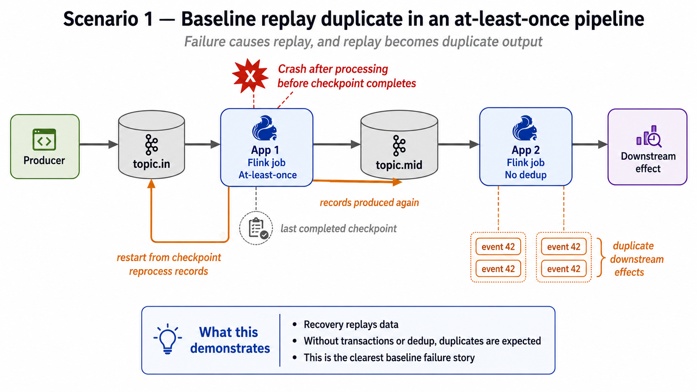
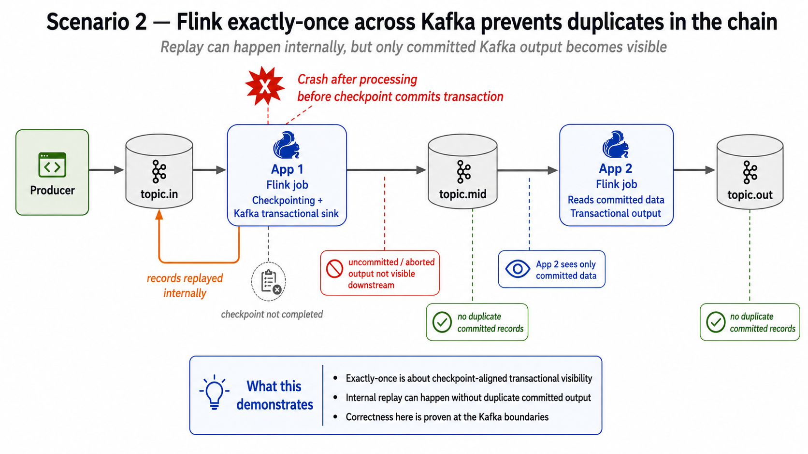
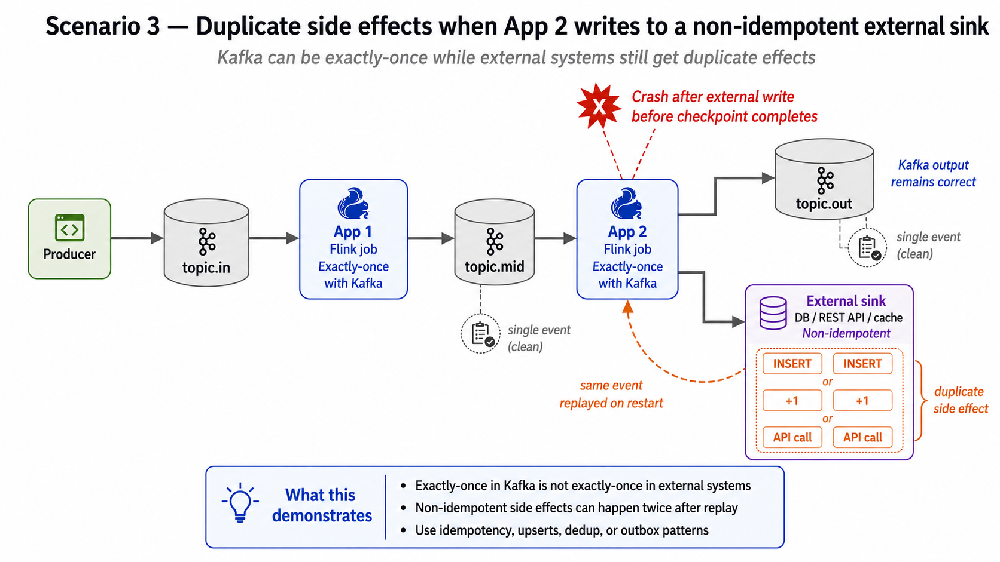
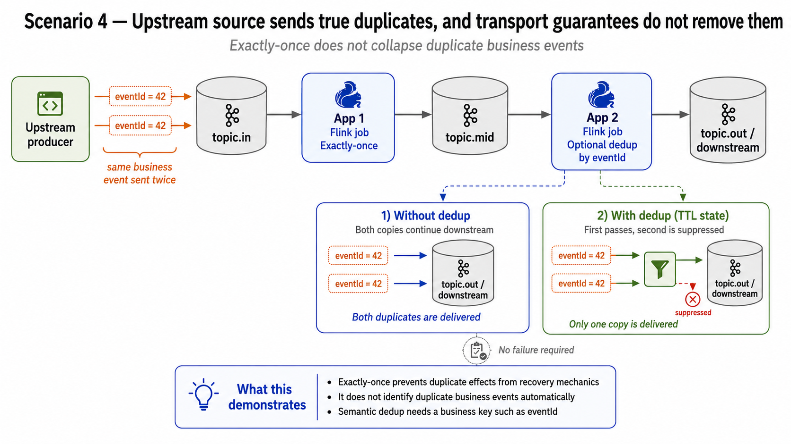
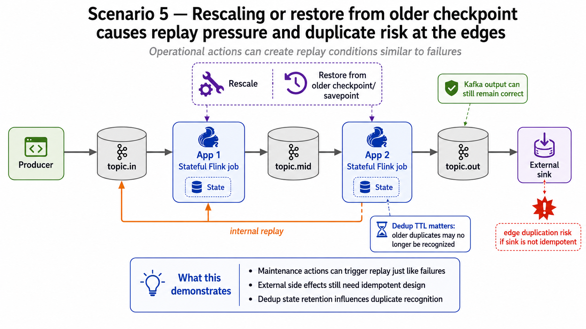

# Flink Workshop: Reliability, Failover, Joins, Time

A hands-on workshop exploring how Apache Flink handles failures, replay, joins, and time semantics across ten progressively more complex scenarios. Scenarios 01–06 cover reliability/exactly-once/dedup/rescaling/lakehouse; 07–09 walk through every flavour of join Flink supports (regular, interval, window, lookup, temporal, multi-way) with a failure-aware capstone; 10 is a SQL-only deep dive on event-time, watermarks, and late data.

---

## Prerequisites

| Tool | Purpose |
|---|---|
| Java 17 | Build the JARs |
| Maven 3.9+ | Build tool |
| Podman + `podman compose` | Run the local infrastructure |
| `curl`, `jq` | Used by the quickstart script |

---

## Quick Start

```bash
# Build and run a single scenario (infra starts automatically)
./quickstart.sh 1          # datagen + scenario 01
./quickstart.sh all        # datagen + all 5 scenarios
./quickstart.sh status     # show running jobs
./quickstart.sh stop       # tear everything down
```

The script:
1. Builds the project if JARs are missing
2. Starts Zookeeper, Kafka, Kafka UI, PostgreSQL, Flink JobManager + TaskManager via `podman compose`
3. Creates the three Kafka topics (`topic.in`, `topic.mid`, `topic.out`)
4. Copies each JAR into the Flink container and submits it with the correct env vars

**UIs once running:**
- Flink Web UI: http://localhost:8081
- Kafka UI: http://localhost:8080

---

## Architecture

Every scenario shares the same topology skeleton:

```
FinancialDatagenJob  →  topic.in  →  App 1  →  topic.mid  →  App 2  →  topic.out
                                                                   ↓
                                                          (Scenario 3 only)
                                                          PostgreSQL / external sink
```

App 1 is the producer-side job. App 2 is the consumer/aggregator-side job. The interesting failure and deduplication behaviour happens at the boundary between them.

---

## Scenarios

### Scenario 1 — Baseline AT_LEAST_ONCE: replay duplicates are expected



App 1 runs with `AT_LEAST_ONCE` semantics and no transactional Kafka sink. When it crashes and restarts from a checkpoint, records that were already written to `topic.mid` but not yet checkpointed are replayed — producing duplicate `eventId`s downstream. App 2 counts them with a tumbling window, so the inflated counts are visible in `topic.out`.

**What this demonstrates:**
- Recovery always replays data from the last checkpoint
- Without transactions or dedup, duplicates are the expected outcome
- This is the clearest baseline failure story

**Run:** `./quickstart.sh 1`  
**Verify:** `bash scripts/verify-01.sh`

---

### Scenario 2 — EXACTLY_ONCE Kafka: no duplicates at the Kafka boundary



App 1 uses Flink's Kafka transactional sink. On crash and restart, uncommitted transaction output is invisible to `topic.mid` consumers. App 2 reads with `isolation.level=read_committed`, so it only ever sees committed records — no duplicates reach `topic.out`.

**What this demonstrates:**
- Exactly-once is about checkpoint-aligned transactional visibility
- Internal replay can happen without duplicate committed output
- Correctness is proven at the Kafka boundaries

**Run:** `./quickstart.sh 2`  
**Verify:** `bash scripts/verify-02.sh`

---

### Scenario 3 — External sink duplicates: Kafka exactly-once does not cover your database



App 1 is exactly-once at the Kafka layer (same as Scenario 2). App 2 reads from `topic.mid` exactly-once and writes to PostgreSQL. The database is outside the Flink checkpoint protocol, so a crash between a successful DB write and a successful checkpoint causes the write to be replayed on restart — a duplicate side effect. The scenario ships both a buggy (`INSERT`) and a fixed (`ON CONFLICT DO UPDATE` upsert) sink, toggled by `SINK_MODE`.

**What this demonstrates:**
- Exactly-once in Kafka is not exactly-once in external systems
- Non-idempotent side effects can happen twice after replay
- Use idempotency, upserts, dedup, or outbox patterns for external sinks

**Run:** `./quickstart.sh 3`  
**Verify:** `bash scripts/verify-03.sh`

---

### Scenario 4 — Upstream true duplicates: transport guarantees do not collapse business duplicates



The upstream producer intentionally sends the same business event twice (same `eventId`, different Kafka messages). Flink's exactly-once transport delivers both faithfully — it prevents *recovery* duplicates but has no knowledge of *business* duplicates. App 2 is available in two variants:

- **Naive** (`App2PipelineNaive`) — counts both copies, inflating results
- **With dedup** (`App2PipelineWithDedup`) — keys by `eventId` with a TTL `ValueState`; the second copy is dropped

**What this demonstrates:**
- Exactly-once prevents duplicates from recovery mechanics
- It does not identify duplicate business events automatically
- Semantic dedup needs a business key such as `eventId`

**Run:** `./quickstart.sh 4`  
**Verify:** `bash scripts/verify-04.sh`

---

### Scenario 5 — Rescaling and savepoint replay: operational actions carry the same risk as failures



App 1 is a stateful enrichment job keyed by `accountId`. App 2 uses event-time tumbling windows with a 5-second watermark tolerance. Restoring from a savepoint taken at an earlier offset causes Kafka offset replay, injecting records that downstream may have already processed — the same duplication risk as a crash, but triggered deliberately by an operator action.

**What this demonstrates:**
- Maintenance actions (rescale, restore) trigger replay just like failures
- External side effects still need idempotent design
- Dedup state retention matters: older duplicates may no longer be recognized

**Run:** `./quickstart.sh 5`  
**Verify:** `bash scripts/verify-05.sh`

---

### Scenario 6 — Paimon lakehouse + SQL Gateway: stream-to-lake plus ad-hoc query

A Kafka stream of trades is written into an **Apache Paimon** primary-key table backed by **MinIO** (S3-compatible). A **separate Flink session cluster** runs a **SQL Gateway** so analysts can issue ad-hoc SQL over the same lakehouse via REST, the interactive SQL Client, or a tiny built-in web UI — without touching the streaming ingest cluster.

```
Kafka (trades.scenario06) ──► PaimonIngestJob (ingest Flink) ──► MinIO (s3a://paimon/warehouse)
                                                                       │
                                                                       ▼
                              ┌─ curl REST  ──► SQL Gateway ◄── Query Flink session cluster
                              ├─ sql-client.sh ─►   :18083
                              └─ Web UI :3000 ─►
```

**What this demonstrates:**
- Streaming + lakehouse: one job that durably lands Kafka data into queryable columnar storage
- Compute isolation: heavy ad-hoc scans run on a different Flink cluster from the ingest writer
- Three query surfaces over the same Paimon table: REST (curl), SQL Client, Web UI
- Paimon snapshot semantics: query visibility latency = Flink checkpoint interval (10s)

**Run:**
```bash
podman-compose up -d --build
./scripts/create-topics.sh          # adds trades.scenario06
mvn -pl common,scenario-06-paimon-lakehouse -am package
./scripts/init-paimon.sh            # creates catalog/database/table
./scripts/submit-scenario-06.sh     # Kafka -> Paimon ingest
# In another shell, produce trades via the existing datagen job
./scripts/query-rest.sh "SELECT COUNT(*) FROM paimon.workshop.trades"
open http://localhost:3000          # web UI with prebaked queries
```

**Verify:** `bash scripts/verify-06.sh`

---

## Joins Track (07–09)

Three scenarios that cover every flavour of join Flink supports. Each one ships a DataStream implementation **and** the equivalent Flink SQL in `sql-notes/scenario-sql-equivalents.md` so learners can compare both APIs side by side.

| # | What it teaches | Module |
|---|---|---|
| 07 | Stream-stream joins: INNER / LEFT / RIGHT / FULL OUTER, interval (±5s), tumbling window | `scenario-07-stream-stream-joins` |
| 08 | Stream-table joins: async lookup vs temporal/versioned (FX rate AS OF tradeTime) | `scenario-08-stream-table-joins` |
| 09 | Multi-way join (trade ⋈ quote ⋈ fx ⋈ account) + deliberate crash + recovery | `scenario-09-multiway-join-recovery` |

### Scenario 07 — Stream-Stream Joins

Three apps in one module, each demoing a different join kind:

- `App07RegularJoin` — `topic.orders` ⋈ `topic.fills` keyed by eventId. Output has a `joinKind ∈ {INNER, LEFT_ORPHAN, RIGHT_ORPHAN}` tag so all four SQL join kinds are demonstrated from one stream. Bounded by per-key processing-time timer (30s) + `StateTtlConfig` (1h). Datagen comes from `OrderFillSplitterJob` which fans `topic.in` into orders + fills with configurable drop/orphan rates.
- `App07IntervalJoin` — `trades.intervalJoin(quotes).between(-5s, +5s)` by ticker. State is bounded by the interval itself — no TTL needed.
- `App07WindowJoin` — 1-minute tumbling event-time co-windows of trade and quote counts per ticker.

**Teaching points:** regular joins keep state forever unless TTL'd; interval joins evict automatically; window joins only emit when both sides have data in the same window.

**Run:** `./quickstart.sh 7` &nbsp;·&nbsp; **Verify:** `bash scripts/verify-07.sh`

### Scenario 08 — Stream-Table Joins

- `App08LookupJoin` — `AsyncDataStream.unorderedWait` calling Postgres `accounts` via `RichAsyncFunction` + HikariCP + a Caffeine 5-minute LRU cache. Pure processing-time semantics.
- `App08TemporalJoin` — `KeyedCoProcessFunction` with `MapState<rateTime, rate>` per currency. Looks up the latest rate where `rateTime ≤ trade.tradeTime` — event-time AS-OF semantics.

**Teaching point:** lookup join answers "current row, processing time"; temporal join answers "row as of event time". They're routinely confused — running both back-to-back makes the difference unmistakable.

**Run:** `./quickstart.sh 8` &nbsp;·&nbsp; **Verify:** `bash scripts/verify-08.sh`

### Scenario 09 — Multi-Way Join + Crash Recovery

`App09MultiWayJoin` chains all three join styles: interval (trade ⋈ quote) → temporal (... ⋈ fx) → async lookup (... ⋈ account). `CrashTrigger` fires after `CRASH_AFTER_RECORDS=5000` enriched records. EXACTLY_ONCE Kafka sink + read_committed consumer prove the join state recovers correctly across the crash.

**Teaching points:** join state lives in keyed state and is checkpointed like everything else; watermark alignment across three event-time streams matters; state size grows regular > interval > window.

**Run:** `./quickstart.sh 9` &nbsp;·&nbsp; **Verify:** `bash scripts/verify-09.sh`

---

## Scenario 10 — Event Time, Watermarks, Late Data (SQL-only)

Eight progressive `.sql` files under `scenario-10-event-time-sql/sql/`, taught through the SQL Gateway from scenario 06:

1. `PROCTIME()` baseline
2. Event-time + `WATERMARK FOR ts AS ts - INTERVAL '5' SECOND`
3. Processing-time tumbling window
4. Event-time tumbling window — same SELECT, deterministic under replay
5. `scan.watermark.idle-timeout` — keep watermarks moving when a partition pauses
6. `table.exec.window-allowed-lateness` — retract+revise output for late events
7. Route late-arriving records to a side topic via `CURRENT_WATERMARK()`
8. `scan.watermark.alignment.*` — bound the gap between fast and slow partitions

**Run:** `./quickstart.sh 10` then `bash scripts/run-scenario-10-sql.sh`

---

## Apache Fluss Track (11–16)

Six new scenarios introducing **Apache Fluss (incubating)** — a streaming
storage system designed for Flink that fills the gap between Kafka and a
lakehouse. Each one builds on the previous; learners start with zero
Fluss knowledge in scenario 11.

| # | Module | Focus |
|---|---|---|
| 11 | `scenario-11-fluss-fundamentals` | What Fluss is, log vs PK tables, why-Fluss-vs-Kafka (SQL only) |
| 12 | `scenario-12-fluss-wide-schemas` | 45-column financial schemas + projection/filter pushdown (SQL only) |
| 13 | `scenario-13-fluss-partial-updates` | Customer-360 from 3 sources, all four merge engines + Java DataStream `WideProfileUpdaterJob` |
| 14 | `scenario-14-fluss-streaming-joins` | Lookup joins from streams into Fluss PK tables + delta-join concept (SQL only) |
| 15 | `scenario-15-fluss-java-clients` | Three Java apps: SDK point-lookup, HTTP service, Flink connector enrichment |
| 16 | `scenario-16-fluss-paimon-tiered-spark` | `'table.datalake.enabled' = 'true'` + Spark Java jobs against both Paimon and live Fluss |

**Prereqs for the Fluss track:**
```bash
podman-compose up -d --build         # spins up Fluss coordinator + 2 tablet servers + Spark
bash scripts/init-fluss.sh           # creates Fluss catalog, database, and all workshop tables
bash scripts/seed-fluss.sh           # streams wide financial data into every table
```

**Run a Fluss scenario:**
```bash
./quickstart.sh 11    # … or 12 / 13 / 14 / 15 / 16
bash scripts/verify-11.sh
```

Each scenario's README + `WORKSHOP.md` is a self-contained teaching path.
Scenario 11's `sql/06-kafka-compacted-vs-fluss.sql` is the centerpiece
"why Fluss?" comparison.

---

## Infrastructure

| Service | Image | Port |
|---|---|---|
| Kafka | `apache/kafka:4.2.0` | 19092 (host), 9093 (internal) |
| PostgreSQL | `postgres:16` | 15432 |
| Flink JobManager (ingest) | `workshop/flink-fluss:1.20` | 18081 |
| Flink TaskManager (ingest) | `workshop/flink-fluss:1.20` | — |
| Flink JobManager (query) | `workshop/flink-fluss:1.20` | 18181 |
| Flink TaskManager (query) | `workshop/flink-fluss:1.20` | — |
| Flink SQL Gateway | `workshop/flink-fluss:1.20` | 18083 (REST) |
| MinIO | `minio/minio:latest` | 19000 (S3), 19001 (console) |
| Query Web UI | `workshop/query-ui:latest` | 3000 |
| Fluss ZooKeeper (scenarios 11–16) | `zookeeper:3.9.2` | — |
| Fluss Coordinator | `apache/fluss:0.9.1-incubating` | 19123 (protocol) |
| Fluss TabletServer ×2 | `apache/fluss:0.9.1-incubating` | — |
| Spark 3.5 (scenario 16) | `workshop/spark-paimon-fluss:3.5.5` | 14040 (Spark UI) |

Kafka topics:
- Scenarios 01–05: `topic.in` · `topic.mid` · `topic.out` (4 partitions each)
- Scenario 06: `trades.scenario06`
- Scenarios 07–09: `topic.quotes` · `topic.fxrates` (1 partition — preserves changelog ordering) · `topic.orders` · `topic.fills` · `topic.enriched.s07` · `topic.enriched.s08` · `topic.enriched.s09`
- Scenario 10: `topic.late.s10`

PostgreSQL credentials: `workshop / workshop / workshop`

Checkpoints and savepoints are stored in named Podman volumes (`flink-checkpoints`, `flink-savepoints`) so they survive container restarts.

---

## Project Structure

```
flink-examples/
├── quickstart.sh                        # one-command local runner
├── podman-compose.yml                   # full local stack
├── common/                              # shared utilities + FinancialDatagenJob
├── scenario-01-baseline-at-least-once/
├── scenario-02-exactly-once-kafka/
├── scenario-03-external-sink-duplicates/
├── scenario-04-upstream-true-duplicates/
├── scenario-05-rescaling-replay/
├── scenario-06-paimon-lakehouse/        # Kafka -> Paimon + SQL Gateway
├── scenario-07-stream-stream-joins/     # regular / interval / window joins
├── scenario-08-stream-table-joins/      # lookup (Postgres) vs temporal (FX)
├── scenario-09-multiway-join-recovery/  # trade ⋈ quote ⋈ fx ⋈ account + crash
├── scenario-10-event-time-sql/          # SQL-only: event-time, watermarks, late data
├── scenario-11-fluss-fundamentals/      # SQL: what is Fluss + log/PK tables
├── scenario-12-fluss-wide-schemas/      # SQL: wide schemas + projection pushdown
├── scenario-13-fluss-partial-updates/   # SQL + Java: merge engines, partial-update job
├── scenario-14-fluss-streaming-joins/   # SQL: lookup join + delta-join concept
├── scenario-15-fluss-java-clients/      # Java: SDK + HTTP service + Flink+Fluss DataStream
├── scenario-16-fluss-paimon-tiered-spark/  # SQL + Spark: tiered storage to Paimon
├── docker/
│   ├── flink-paimon/                    # Flink 1.20 image + Paimon + S3 plugin
│   └── query-ui/                        # Node web UI for ad-hoc SQL Gateway queries
└── scripts/
    ├── create-topics.sh
    ├── verify-01.sh … verify-06.sh
    ├── init-paimon.sh                   # bootstrap Paimon catalog/table
    ├── submit-scenario-06.sh            # submit Kafka -> Paimon ingest
    ├── query-rest.sh                    # ad-hoc SQL via SQL Gateway REST
    ├── sql-client.sh                    # interactive SQL Client via gateway
    └── init-postgres.sql
```

---

## Building Manually

```bash
mvn clean package -DskipTests
```

The shade plugin produces a `*-jar-with-dependencies.jar` per app inside each module's `target/` directory. The quickstart script skips the build if those JARs already exist.
